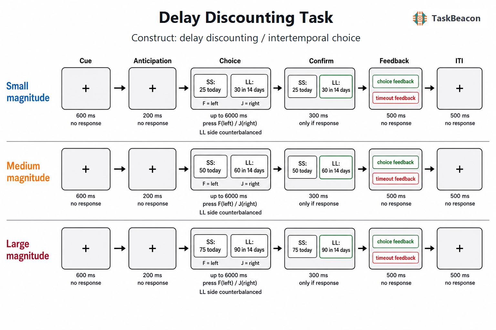

# 延迟折扣任务：跨期选择的计算表征、神经基础与测量边界

跨期选择研究关注个体如何权衡收益金额与获得时间。延迟折扣（delay discounting）指结果的主观价值随等待时间增加而降低；其核心测量问题，是在可比较的选择集合中分离金额、延迟与选择随机性对行为的共同影响。延迟折扣任务以较小较早收益（smaller-sooner reward, SS）和较大较晚收益（larger-later reward, LL）之间的二元选择构造主观等值点或折扣参数，因而可用于检验时间偏好模型，并研究成瘾、精神病理及生命周期差异。该范式产生的是特定任务条件下的选择指标，不能直接等同于一般“冲动性”、现实生活中的自我控制能力或个体诊断标志（Bailey et al., 2021; Lempert et al., 2019）。

## 1. 范式提出与理论背景

延迟收益研究早期多采用动物强化程序。Mazur（1987）提出调整延迟程序：依据前一选择改变某一选项的等待时间，直至两个选项近似无差异，并以此检验双曲折扣函数。常用形式为 \(V=A/(1+kD)\)，其中 \(V\) 为延迟收益的当前主观价值，\(A\) 为名义金额，\(D\) 为延迟，\(k\) 为折扣率；较大的 \(k\) 表示价值随延迟下降更快。双曲形式能够描述折扣率随时间尺度变化及偏好反转，但其经验拟合优势不意味着所有参与者均遵循同一函数，也不排除时间知觉、风险预期和流动性约束等替代解释（Peters & Büchel, 2011）。

Kirby 与 Maraković（1996）将固定备选项用于大样本人类货币选择，并证明收益量级会改变估计的折扣率：金额较大的延迟收益通常被折扣得更少。Kirby 等（1999）随后形成广泛使用的 27 项货币选择问卷（Monetary Choice Questionnaire, MCQ-27）。该问卷以预设金额、延迟和隐含 \(k\) 阈值覆盖小、中、大三个金额层级，通过一组 SS—LL 选择快速估计折扣倾向。其固定题组减少了逐延迟滴定所需试次，适于群体差异研究；代价是测量分辨率受预设阈值与项目范围限制，且各金额层级的估计不应在未检验量级效应时任意合并。

## 2. 任务逻辑、流程与核心指标

经典 MCQ-27 以一次呈现一个 SS—LL 组合为基本试次。SS 通常为立即可得的较小金额，LL 为数天至数月后可得的较大金额；参与者选择偏好选项，任务没有正确答案，也不依据表现改变后续项目。题目可随机排序，SS/LL 的左右位置应平衡，以降低序列和运动反应偏倚。经典问卷本身通常为自定步速，研究者若增加反应时限、固定注视或反馈阶段，应把这些操作视为具体实现参数，而非 MCQ-27 的必要组成。

每个项目对应一个使两选项在双曲模型下等值的参考折扣率。传统计分在候选 \(k\) 中寻找与选择模式一致性最高者；并列时可取相邻估计的几何平均，同时分别报告三个金额层级的结果（Kaplan et al., 2016; Kirby et al., 1999）。高 \(k\) 或较高 SS 选择比例表示在该题组中对延迟更敏感。LL 选择比例是直观的描述指标，但没有同时控制金额差、延迟和项目难度；反应时则主要反映价值差接近程度、比较负荷及反应准备，不能单独解释为冲动程度。对于可逐延迟获得主观等值点的任务，经验折扣曲线下面积（area under the curve, AUC）提供不依赖特定函数形式的汇总指标，但其数值仍由所取延迟与金额范围决定（Myerson et al., 2001）。

选择构念必须对应可识别的操作。SS 相对 LL 的选择反映金额与时间联合变化后的偏好；模型估计的主观价值差更接近逐试次决策证据；金额层级之间的 \(k\) 差异用于检验量级效应；同一测验跨时重复所得的个体排序才涉及重测信度。实际支付与假设收益、日期表述与“若干天后”表述、延迟收益的不确定感、当前财务压力以及对未来自我的表征均可能改变选择。因此，SS 选择不能脱离奖励类型、时间表达和样本处境而被解释为稳定人格属性。

实验设计还需区分参数可识别性与试次数效率。若金额差和延迟高度相关，单个 \(k\) 可以拟合总体选择，却难以判断差异源于时间敏感性还是金额效用曲率；若多数项目远离个体等值点，选择几乎确定，参数估计又主要由少数困难试次决定。固定题组宜同时报告项目层面的选择一致性和各金额层级估计。神经影像或计算建模研究则应在个体预实验或分层模型中控制选择难度，避免把困难试次增加引起的注意和冲突活动误写为折扣率本身的神经表征（Lakhani et al., 2026; Peters & Büchel, 2011）。

## 3. 主要行为与神经科学发现

### 3.1 行为规律与计算解释

延迟增加通常降低 LL 的选择概率，LL 金额增加则提高其选择概率；两者的共同作用可由折扣函数与随机选择规则表示。量级效应表明，金额并非简单线性缩放：同一个体对较大金额往往表现出较低的折扣率（Kirby & Maraković, 1996）。固定项目 MCQ 的优势在于短时获得跨层级的可比较选择模式，而调整金额或调整延迟任务能更密集地估计等值点。不同程序即使都标记为“延迟折扣”，也可能因选项范围、题数、真实支付、随机化与计分模型而产生不同参数；跨研究比较应优先核对这些操作，而非只比较 \(k\) 的均值。

成瘾研究推动了 MCQ 的应用。Kirby 等（1999）观察到海洛因依赖组较非用药对照组具有更高的货币折扣率，后续连续变量元分析也显示折扣率与成瘾行为之间存在总体关联（Amlung et al., 2017）。精神病理元分析在多个诊断类别中发现较陡折扣，但效应大小、方向和可用研究数并不一致；例如部分进食障碍表现不同于以 SS 偏好增加为主的类别（Amlung et al., 2019）。这些结果支持延迟折扣作为跨诊断研究变量，却不足以建立疾病特异性。共病、收入、药物状态和任务版本可同时影响组间差异，群体效应也不能直接转化为个体分类。

### 3.2 fMRI 与 EEG 证据

早期功能磁共振成像（functional magnetic resonance imaging, fMRI）研究将立即收益和延迟收益的选择差异解释为相对分离的价值系统（McClure et al., 2004）。随后研究更稳定地表明，腹内侧前额叶、腹侧纹状体和后扣带等区域的活动随折扣后的主观价值变化，而外侧前额叶及顶叶网络更多参与比较、注意与选择控制；这类结果支持多种计算过程在同一选择中协同参与，不能由“冲动系统—控制系统”的简单对立概括（Kable & Glimcher, 2007; Peters & Büchel, 2011）。通过错开金额、延迟和选择信息的呈现，Ballard 与 Knutson（2009）进一步区分了金额和延迟相关活动，说明二者在形成综合决策价值前具有部分可分的表征。

近期包含 80 项 fMRI 研究的元分析比较了不同统计对比。主观价值对比稳定涉及估值网络，任务相对基线和选择难度对比稳定涉及额顶与显著性网络；“冲动选择相对耐心选择”及患者—对照对比没有产生同等稳健的预期模式（Lakhani et al., 2026）。该证据支持按计算变量和任务阶段定义神经对比，并限制了以单一区域活动推断一般冲动性的做法。发育样本的静息态研究还发现，9—23 岁参与者的折扣差异与背侧前额叶同默认网络、注意网络之间的连接模式相关，但横断面连接相关不能说明发育因果过程（Mehta et al., 2023）。

脑电图（electroencephalography, EEG）补充了选择后的毫秒级过程。Stam 等（2024）在 MCQ-27 中发现，即时选择后的中央—顶叶错误正波（error positivity, Pe）与折扣率仅呈较弱关系，结果更适合解释为选择后冲突监测，而非定位某个折扣“中枢”。目前任务特异性 EEG 证据的数量与一致性低于 fMRI；头皮电位可约束时间进程，但不能凭振幅差异确定深部价值网络的空间来源。

## 4. 范式发展与主要应用

方法发展主要沿三条方向展开。其一，固定问卷、滴定程序和短版自适应测量在时长与参数精度之间取舍；MCQ-27 适合快速个体差异测量，滴定设计更适合检验函数形状。其二，计算分析从单一 \(k\) 扩展到 AUC、分层模型和包含选择噪声的概率模型，以避免将偶发不一致全部归入折扣率。其三，研究由健康成人扩展到发育、成瘾和精神障碍样本，并将主观价值、选择难度和网络连接作为相互区分的分析对象。

这些扩展改变了范式的使用方式。MCQ 可作为行为表型研究中的低负担指标，也可在干预前后重复测量时间偏好；但若目标是识别短期变化，应以相应时间间隔的重测误差判断变化幅度。神经影像研究应使金额与延迟具有足够变化，并将主观价值参数化对比同简单选择类别分开。临床研究则应预先说明延迟折扣是候选过程、结局预测因子还是干预靶点，三者需要不同的纵向、预测和实验操纵证据。

## 5. 测量效度与解释边界

货币延迟折扣具有一定跨时稳定性。Kirby（2009）报告 MCQ 折扣率在 5 周和约 1 年间保持较高个体排序；更近期的系统综述与元分析汇总 30 篇研究、39 个独立样本和 262 个指标，得到总体重测相关约 \(r=.67\)，且成人、货币结果、设置时间限制及一个月内复测时信度较高（Gelino et al., 2024）。该结果支持其作为相对稳定的个体差异指标，同时表明可靠性取决于测量情境。稳定的排序不能证明构念纯度，也不保证单次测量足以评估个体变化。

构念效度面临三类限制。第一，\(k\)、AUC 和 SS/LL 比例对项目范围与模型假设的依赖不同；同名指标不能在未统一计分时直接互换。第二，货币、食物、药物和健康结果的折扣并非完全等价，假设收益与实际支付也可能改变任务投入和外部效度（Miller et al., 2023）。第三，折扣率与量表冲动性、其他决策任务及现实行为的联系多为有限相关。批判性综述指出，现有证据尚未证明其对具体精神障碍具有足够敏感性与特异性，也不支持把折扣率视为个人全部决策模式的摘要（Bailey et al., 2021）。因此，研究设计应报告项目、金额、延迟、支付方式、无效或不一致选择标准及计分程序，并将临床解释限制在样本和任务所支持的范围内。

纵向和干预研究还应把“均值稳定”与“个体排序可靠”分开。群体平均 \(k\) 在两次测量间无显著变化，不能替代重测相关或组内相关系数；较高重测相关也不能证明某次个体变化超过测量误差。若结局为治疗反应或复发，预测效度应在独立样本中评价，并与病程、社会经济状况和基线症状等简单预测变量比较。只有当折扣指标提供增量预测且变化先于临床结局时，才可进一步讨论其作为过程指标的价值（Gelino et al., 2024; Lempert et al., 2019）。

## 6. TaskBeacon 中的任务实现

### 6.1 任务资源与访问入口

| 资源 | ID | 用途 | 地址 |
|---|---|---|---|
| 本地完整实现 | T000017 | 中文行为实验、源代码与数据记录 | [GitHub 仓库](https://github.com/TaskBeacon/T000017-delay-discounting) |
| 浏览器预览实现 | H000017 | 缩短试次数的行为流程预览 | [GitHub 仓库](https://github.com/TaskBeacon/H000017-delay-discounting) |
| 在线体验 | H000017 | 直接运行浏览器预览 | [TaskBeacon Preview](https://taskbeacon.github.io/psyflow-web/?task=H000017-delay-discounting) |
| 任务页面 | T000017 / H000017 | 核验版本、成熟度与配对关系 | [TaskBeacon 任务页](https://taskbeacon.github.io/tasks/T000017-delay-discounting/) |

T000017 是当前行为型本地实现，任务页面将其标记为草案；H000017 是与本地流程对齐但缩短试次数的 HTML 行为预览。浏览器版本用于了解刺激与反应流程，不能替代本地研究实施或被表述为 EEG、MRI 采集版本。

### 6.2 实现流程与关键参数

TaskBeacon 当前版本采用 MCQ-27 风格固定项目池，运行 1 个区块共 27 个试次，小、中、大金额层级各 9 项。项目按种子随机排序；LL 左右侧近似等量，F/J 分别选择左/右。SS 金额为 15—90 元，LL 金额为 30—100 元，延迟为 7—186 天。程序记录项目、金额、延迟、参考 \(k\)、选择、反应时和超时，并汇总有效作答率与 LL 比例。流程无自适应滴定，也不在任务内输出个体最终 \(k\)；模型计分需在分析阶段完成。

| 阶段 | 当前参数与反应规则 |
|---|---|
| 试次前注视 | 600 ms 注视点；随后 200 ms 注视间隔；无反应 |
| 跨期选择 | 同屏呈现 SS 与 LL，最长 6000 ms；F 选左、J 选右 |
| 选择确认 | 有效反应后高亮所选侧 300 ms |
| 结果反馈 | 有效选择显示“已记录”，超时显示超时信息，500 ms；不提供正确性或收益反馈 |
| 试次间隔 | 注视点 500 ms |

**图 1. TaskBeacon 延迟折扣任务的试次结构。** 小、中、大金额条件均依次经历 600 ms 中性注视、200 ms 注视间隔、最长 6000 ms 的 SS—LL 选择、有效反应后的 300 ms 选择确认、500 ms 记录/超时反馈及 500 ms 试次间隔。SS 为当日较小金额，LL 为延迟若干天的较大金额；LL 左右位置按试次平衡，参与者以 F/J 选择左/右选项。反馈仅确认是否记录，不评价选择正确性；项目与位置按固定种子生成，任务无自适应阶梯。

本地实现将经典自定步速问卷改为有 6 s 反应窗的事件化流程，并增加注视、确认和反馈阶段。这些设置有利于统一反应时测量和事件标记，但超时率及时间压力可能改变原始问卷中的偏好估计。现有仓库文件无法确认金额是否按某一随机选中试次兑换为实际收益，因此结果应按假设性货币选择解释，除非具体研究方案另行规定并记录支付程序。

## 参考文献

Amlung, M., Marsden, E., Holshausen, K., Morris, V., Patel, H., Vedelago, L., Naish, K. R., Reed, D. D., & McCabe, R. E. (2019). Delay discounting as a transdiagnostic process in psychiatric disorders: A meta-analysis. *JAMA Psychiatry, 76*(11), 1176–1186. https://doi.org/10.1001/jamapsychiatry.2019.2102

Amlung, M., Vedelago, L., Acker, J., Balodis, I., & MacKillop, J. (2017). Steep delay discounting and addictive behavior: A meta-analysis of continuous associations. *Addiction, 112*(1), 51–62. https://doi.org/10.1111/add.13535

Bailey, A. J., Romeu, R. J., & Finn, P. R. (2021). The problems with delay discounting: A critical review of current practices and clinical applications. *Psychological Medicine, 51*(11), 1799–1806. https://doi.org/10.1017/S0033291721002282

Ballard, K., & Knutson, B. (2009). Dissociable neural representations of future reward magnitude and delay during temporal discounting. *NeuroImage, 45*(1), 143–150. https://doi.org/10.1016/j.neuroimage.2008.11.004

Gelino, B. W., Schlitzer, R. D., Reed, D. D., & Strickland, J. C. (2024). A systematic review and meta-analysis of test–retest reliability and stability of delay and probability discounting. *Journal of the Experimental Analysis of Behavior, 121*(3), 358–372. https://doi.org/10.1002/jeab.910

Kable, J. W., & Glimcher, P. W. (2007). The neural correlates of subjective value during intertemporal choice. *Nature Neuroscience, 10*(12), 1625–1633. https://doi.org/10.1038/nn2007

Kaplan, B. A., Amlung, M., Reed, D. D., Jarmolowicz, D. P., McKerchar, T. L., & Lemley, S. M. (2016). Automating scoring of delay discounting for the 21- and 27-item Monetary Choice Questionnaires. *The Behavior Analyst, 39*(2), 293–304. https://doi.org/10.1007/s40614-016-0070-9

Kirby, K. N. (2009). One-year temporal stability of delay-discount rates. *Psychonomic Bulletin & Review, 16*(3), 457–462. https://doi.org/10.3758/PBR.16.3.457

Kirby, K. N., & Maraković, N. N. (1996). Delay-discounting probabilistic rewards: Rates decrease as amounts increase. *Psychonomic Bulletin & Review, 3*(1), 100–104. https://doi.org/10.3758/BF03210748

Kirby, K. N., Petry, N. M., & Bickel, W. K. (1999). Heroin addicts have higher discount rates for delayed rewards than non-drug-using controls. *Journal of Experimental Psychology: General, 128*(1), 78–87. https://doi.org/10.1037/0096-3445.128.1.78

Lakhani, N. V., Souther, M. K., Boateng, B., & Kable, J. W. (2026). A meta-analysis of neural systems underlying delay discounting: Implications for transdiagnostic research. *Imaging Neuroscience, 4*, Article IMAG.a.1170. https://doi.org/10.1162/imag.a.1170

Lempert, K. M., Steinglass, J. E., Pinto, A., Kable, J. W., & Simpson, H. B. (2019). Can delay discounting deliver on the promise of RDoC? *Psychological Medicine, 49*(2), 190–199. https://doi.org/10.1017/S0033291718001770

Mazur, J. E. (1987). An adjusting procedure for studying delayed reinforcement. In M. L. Commons, J. E. Mazur, J. A. Nevin, & H. Rachlin (Eds.), *Quantitative analyses of behavior: Vol. 5. The effect of delay and of intervening events on reinforcement value* (pp. 55–73). Lawrence Erlbaum Associates.

McClure, S. M., Laibson, D. I., Loewenstein, G., & Cohen, J. D. (2004). Separate neural systems value immediate and delayed monetary rewards. *Science, 306*(5695), 503–507. https://doi.org/10.1126/science.1100907

Mehta, K., Pines, A., Adebimpe, A., Larsen, B., Bassett, D. S., Calkins, M. E., Baller, E. B., Gell, M., Patrick, L. M., Shafiei, G., Gur, R. E., Gur, R. C., Roalf, D. R., Romer, D., Wolf, D. H., Kable, J. W., & Satterthwaite, T. D. (2023). Individual differences in delay discounting are associated with dorsal prefrontal cortex connectivity in children, adolescents, and adults. *Developmental Cognitive Neuroscience, 62*, Article 101265. https://doi.org/10.1016/j.dcn.2023.101265

Miller, B. P., Reed, D. D., & Amlung, M. (2023). Reliability and validity of behavioral-economic measures: A review and synthesis of discounting and demand. *Journal of the Experimental Analysis of Behavior, 120*(2), 263–280. https://doi.org/10.1002/jeab.860

Myerson, J., Green, L., & Warusawitharana, M. (2001). Area under the curve as a measure of discounting. *Journal of the Experimental Analysis of Behavior, 76*(2), 235–243. https://doi.org/10.1901/jeab.2001.76-235

Peters, J., & Büchel, C. (2011). The neural mechanisms of inter-temporal decision-making: Understanding variability. *Trends in Cognitive Sciences, 15*(5), 227–239. https://doi.org/10.1016/j.tics.2011.03.002

Stam, C. H., van der Veen, F. M., & Franken, I. H. A. (2024). Evidence for post-decisional conflict monitoring in delay discounting. *Biological Psychology, 192*, Article 108849. https://doi.org/10.1016/j.biopsycho.2024.108849
